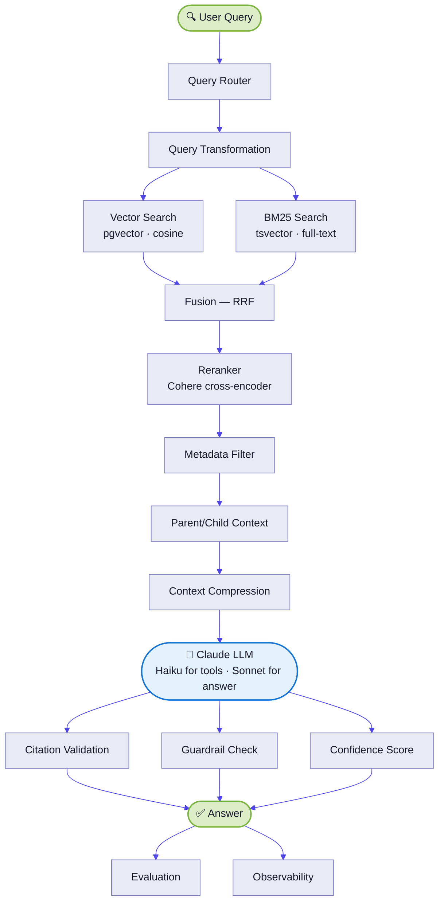
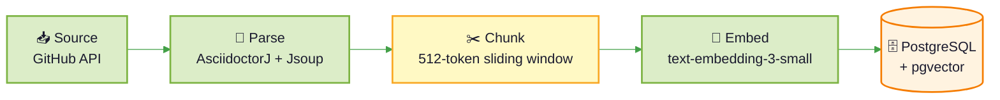
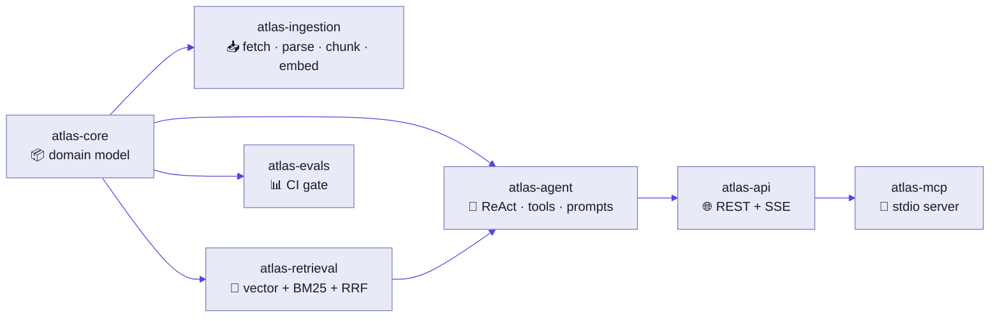

# Atlas RAG — Spring AI Learning Vehicle

A Q&A service over Spring AI documentation, rebuilt from scratch as an interview/portfolio
project — one AI-engineering technique per module, in Java, with the design reasoning
documented at every step.

**Full design and current status:** [`docs/PLAN.md`](docs/PLAN.md) and
[`docs/progress.md`](docs/progress.md).

---

## Architecture

### Query Pipeline



### Ingestion Pipeline



### Module Mapping



### Phase Build Order

| Phase | What we build | What we learn |
|-------|--------------|---------------|
| **A — Vector only** | Vector search against chunks table | Where cosine similarity fails (exact keywords, class names) |
| **B — BM25 only** | Add tsvector column, full-text search | Where keyword matching fails (semantic similarity) |
| **C — Hybrid** | Combine with RRF | Why neither alone is sufficient |

---

## Techniques

| Technique | Module |
|---|---|
| Hybrid retrieval (BM25 + pgvector + RRF) | `atlas-retrieval` |
| Tool calling + ReAct agent loop | `atlas-agent` |
| Prompt caching | `atlas-agent` |
| Structured output | `atlas-agent` |
| Streaming (SSE) | `atlas-api` |
| Evals as a CI gate | `atlas-evals` |
| MCP server | `atlas-mcp` |

## Modules

```
atlas-core        Shared domain model
atlas-ingestion   CLI: fetch Spring AI docs from GitHub -> chunk -> embed -> load
atlas-retrieval   Hybrid search: BM25 + pgvector + RRF
atlas-agent       ReAct agent, tool calling, prompt caching, structured output
atlas-api         Spring Boot app: REST + SSE endpoints
atlas-mcp         MCP server: exposes ask_atlas over stdio
atlas-evals       Eval dataset and CI runner
```

## Status

Rebuild in progress — see [`docs/progress.md`](docs/progress.md) for the live checklist.

## Stack

Java 21, Spring Boot 3.4.5, Spring AI 1.1.5, PostgreSQL + pgvector, Anthropic Claude
(Haiku + Sonnet), OpenAI `text-embedding-3-small`.

## License

Apache 2.0
