# AI Engineer & AI Architect Roadmap

> **Engineering Career Guide** · Phase 0 + 9 Sprints · Spring AI · PGVector · LLM APIs · Java / Spring Boot

A practical, implementation-first roadmap for backend engineers building production AI systems — RAG pipelines, agentic workflows, evaluation frameworks, and enterprise AI architecture.

---

## Context: What We're Building Toward

Strong backend engineers don't need to become ML researchers to work in AI. The goal is to add the AI application layer on top of existing systems expertise.

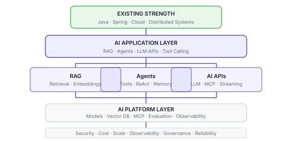

---

## Overview: The 9-Sprint Roadmap

| Sprint | Focus | Phase | Priority |
|:------:|-------|-------|:--------:|
| 0 | LLM Fundamentals | PRE-REQUISITE | **Critical** |
| 1 | Embeddings + Vector DB | FOUNDATION | High |
| 2 | Knowledge Ingestion | FOUNDATION | **Critical** |
| 3 | Hybrid Retrieval | RAG | **Critical** |
| 4 | RAG Question Answering | RAG | **Critical** |
| 5 | Agentic AI + Tools | AGENTS | **Critical** |
| 6 | Advanced AI Applications | AGENTS | High |
| 7 | Evaluation + Observability | PRODUCTION | **Critical** |
| 8 | MCP Integration | PRODUCTION | High |
| 9 | Enterprise Production AI Architecture | ARCHITECTURE | **Critical** |

---

## Sprint by Sprint

---

### 00 · PRE-REQUISITE · LLM Fundamentals

> Build enough understanding of modern LLMs to make architecture and model-selection decisions — without requiring ML-research depth.

<table>
<tr>
<td width="50%" valign="top">

**LEARN DEEPLY**

- Tokens and tokenization
- Context windows and their limits
- Transformer architecture — conceptual understanding
- Attention — conceptual understanding
- Pre-training vs instruction tuning
- RLHF / preference optimisation — high level
- Temperature and top-p sampling
- Generative models vs embedding models
- Reasoning models and tool-use capable models
- Small vs large models — when to use each
- Proprietary vs open-source models
- Model latency / cost / capability trade-offs
- Model selection criteria

</td>
<td width="50%" valign="top">

**ARCHITECT-LEVEL QUESTIONS**

- What actually happens when an LLM receives a prompt?
- Why does tokenization matter for cost and context?
- What determines context-window limits?
- What is the difference between an embedding model and a generative model?
- When would you choose a smaller model over a larger one?
- How do latency, quality and token cost influence model selection?
- How would you choose between GPT, Claude, Gemini or an open-source model?
- What are the trade-offs between hosted APIs and self-hosted models?

> **Scope boundary:** You do not need deep neural-network mathematics, model training, fine-tuning, or ML research depth. The goal is architectural understanding, not academic depth.

</td>
</tr>
</table>

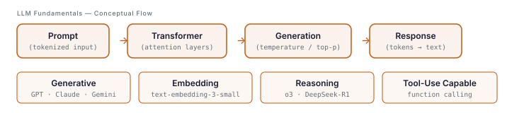

---

### 01 · FOUNDATION · Embedding Foundation

> Understand the fundamental mechanics of semantic retrieval — text to vector to similarity search.

<table>
<tr>
<td width="50%" valign="top">

**LEARN DEEPLY**

- What embeddings are and why they exist
- Embedding models and dimensions
- Semantic similarity vs keyword matching
- Cosine similarity
- PGVector and HNSW index
- Top-K retrieval
- Vector storage trade-offs

</td>
<td width="50%" valign="top">

**INTERVIEW QUESTIONS**

- Why embeddings instead of keyword search?
- Why a vector database?
- Why cosine similarity?
- What does 1536 dimensions mean?
- What happens if you change the embedding model?
- HNSW vs brute-force nearest-neighbour search?

</td>
</tr>
</table>

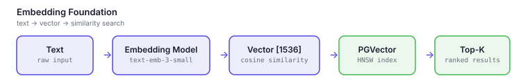

---

### 02 · FOUNDATION · Knowledge Ingestion

> Build the pipeline that converts raw documentation into a searchable vector knowledge base.

<table>
<tr>
<td width="50%" valign="top">

**LEARN DEEPLY**

- Chunking strategy and why it matters
- Token-based chunking and overlap
- Metadata — what to store and why
- Duplicate detection and idempotency
- Re-ingestion handling
- Batch embeddings vs individual calls
- Ingestion scalability

</td>
<td width="50%" valign="top">

**PRINCIPAL-LEVEL QUESTIONS**

- Why 512 tokens? Why 64 overlap?
- What happens if the document changes?
- How do you avoid embedding the same document twice?
- How would you ingest 10 million documents?
- How would you make ingestion asynchronous?
- Batch vs individual API calls?

</td>
</tr>
</table>

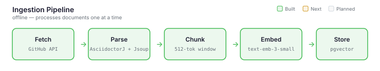

---

### 03 · RAG · Hybrid Retrieval

> Build a retrieval engine that finds the most relevant results — not just the most similar ones.

<table>
<tr>
<td width="50%" valign="top">

**LEARN DEEPLY**

- Semantic vs lexical (BM25) search
- Why vector search alone is not enough
- Reciprocal Rank Fusion — how and why
- Metadata filtering
- Reranking (cross-encoder vs bi-encoder)
- Recall vs precision trade-offs
- Retrieval latency optimisation

</td>
<td width="50%" valign="top">

**KEY ARCHITECT QUESTION**

> *"Why isn't vector search alone enough?"*

This is one of the most important AI Architect questions. Know it cold.

- What is BM25 and when does it beat semantic search?
- How does RRF merge two ranked lists?
- What is a cross-encoder reranker?
- How do you evaluate retrieval quality?

</td>
</tr>
</table>

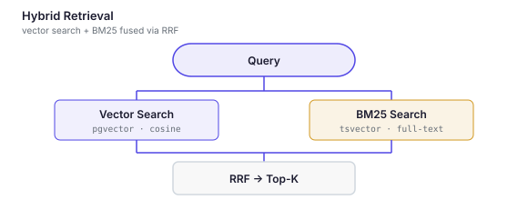

---

### 04 · RAG · RAG Question Answering

> Turn retrieval into an AI application that generates grounded, cited answers.

<table>
<tr>
<td width="50%" valign="top">

**LEARN DEEPLY**

- Prompt construction — system vs user prompt
- Context selection and ordering
- Context window management
- Hallucination — causes and prevention
- Citations and grounding
- Model selection and temperature
- Structured output and streaming

</td>
<td width="50%" valign="top">

**ARCHITECT QUESTIONS**

- How do you prevent hallucination?
- How much context should you send to the LLM?
- What happens when retrieval returns poor results?
- How do you choose between Claude, GPT, or Bedrock?
- How do you control token cost?

Your Java + enterprise architecture background becomes a real advantage here.

</td>
</tr>
</table>

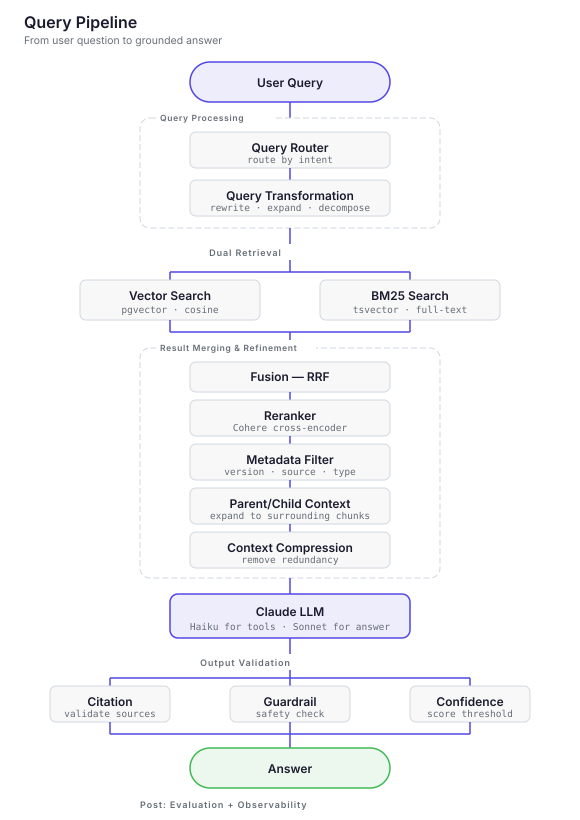

---

### 05 · AGENTS · Agentic AI

> Transform the RAG pipeline into an AI Agent that reasons about which tools to use before answering.

<table>
<tr>
<td width="50%" valign="top">

**LEARN DEEPLY**

- Agent vs deterministic workflow — when to use each
- Tool calling / function calling
- ReAct pattern (Reason + Act)
- Planning and tool selection
- Multi-step execution
- Agent state management
- Failure handling, retries, tool security

</td>
<td width="50%" valign="top">

**ARCHITECT QUESTIONS**

- When should you use an agent vs a deterministic workflow?
- Why not just call tools directly without an agent loop?
- How do you prevent an agent from executing dangerous actions?
- How do you control runaway agent loops?

**High priority** — current AI Architect roles explicitly ask for agentic architectures.

</td>
</tr>
</table>

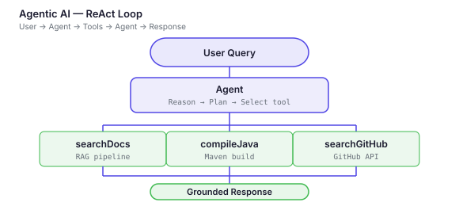

---

### 06 · AGENTS · Advanced AI Applications

> Add memory, streaming, model routing, caching, and structured outputs. Introduce the LLM Gateway pattern.

<table>
<tr>
<td width="50%" valign="top">

**BUILD**

- Conversation memory strategies
- Structured outputs and schema validation
- Streaming responses (SSE)
- Model routing and fallback
- Response caching and token optimisation
- Asynchronous AI workflows

</td>
<td width="50%" valign="top">

**ARCHITECT QUESTIONS**

- How does conversation memory work?
- What are the types of memory in AI agents?
- Why use structured outputs?
- How does streaming improve user experience?
- How do you route between models dynamically?

</td>
</tr>
</table>

**LLM Gateway / Model Platform**

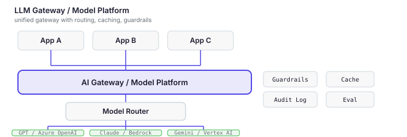

> **Key concerns:** model routing (cost vs quality vs latency), response caching, guardrails (PII, jailbreak), usage quotas, fallback on provider outage, audit logging, API key management.

---

### 07 · PRODUCTION · Evaluation & Observability

> Build the framework to measure whether the system is working and improving over time.

<table>
<tr>
<td width="50%" valign="top">

**EVALUATION**

- Retrieval evaluation (precision, recall, MRR)
- Answer relevance and groundedness
- Hallucination detection
- Citation correctness
- Evaluation datasets and regression testing

</td>
<td width="50%" valign="top">

**OBSERVABILITY**

- Latency at each pipeline stage
- Token usage and cost per request
- Model call and retrieval tracing
- Tool call logging
- Prompt and version tracking

</td>
</tr>
</table>

> **This sprint is not optional for an Architect role.**

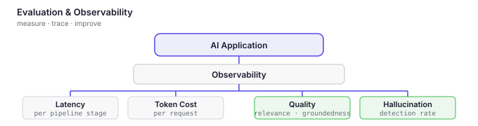

---

### 08 · PRODUCTION · MCP Integration

> Expose the system as an MCP Server so AI clients can interact with it as a platform.

<table>
<tr>
<td width="50%" valign="top">

**BUILD**

- MCP Client and MCP Server
- Tools, resources, and prompts in MCP
- Tool discovery and transport
- Security in MCP
- Enterprise integration via MCP

</td>
<td width="50%" valign="top">

**KEY ARCHITECT QUESTION**

> *"Why MCP instead of ordinary REST APIs?"*

Know this answer at architectural depth, not just implementation.

- How do AI applications discover tools?
- When should MCP replace a traditional API?

</td>
</tr>
</table>

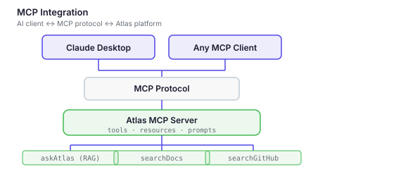

---

### 09 · ARCHITECTURE · Enterprise Production AI Architecture

> This sprint turns "I built a RAG application" into "I can architect an enterprise AI platform." It answers: *how would you run this inside a large organisation?*

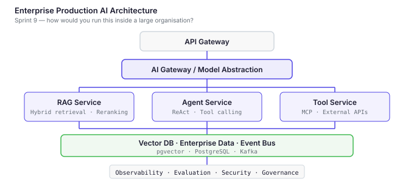

<table>
<tr>
<td width="50%" valign="top">

**1 · Security**

- Authentication and authorisation for AI APIs
- Tenant isolation in multi-tenant AI systems
- PII detection and redaction
- Data leakage prevention
- Prompt injection and jailbreak defences
- Tool authorisation and secrets management

**3 · Reliability**

- LLM provider timeouts and outages
- Retry with exponential backoff
- Fallback models
- Circuit breaker pattern for LLM calls
- Degraded mode (retrieval-only fallback)

**5 · Enterprise Architecture**

- API Gateway → AI Gateway → Model Layer
- RAG service / Agent service / Tool service
- Vector DB and enterprise data integration
- Event-driven ingestion pipelines
- Observability platform

</td>
<td width="50%" valign="top">

**2 · Scalability**

- Ingestion at scale — millions of documents
- Vector DB scaling strategies
- Async ingestion pipelines and queues
- Embedding cache
- Horizontal scaling of AI services

**4 · Cost Management**

- Token economics — prompt vs completion cost
- Embedding cost at scale
- Model routing by query complexity
- Response caching
- Context reduction strategies

**6 · Governance**

- Model approval and change management
- Prompt versioning and rollback
- Audit logging for AI decisions
- Data lineage for RAG sources
- Evaluation gates before promotion

</td>
</tr>
</table>

---

## Interview Preparation: Questions by Domain

<table>
<tr>
<td width="50%" valign="top">

**LLM FUNDAMENTALS**

- What happens when an LLM receives a prompt?
- Why does tokenization matter for cost?
- What limits context windows?
- Embedding model vs generative model?
- When would you choose a smaller model?
- How do temperature and top-p affect output?
- How do you select between GPT, Claude, Gemini?
- Hosted API vs self-hosted model trade-offs?

</td>
<td width="50%" valign="top">

**INGESTION**

- Why do we need chunking?
- How do you choose chunk size?
- Why token-based vs character-based?
- How do you handle re-ingestion?
- How do you scale to 10M documents?
- Batch vs individual embedding calls?

</td>
</tr>
<tr>
<td width="50%" valign="top">

**EMBEDDINGS**

- What is an embedding?
- What determines dimensions?
- What happens if you change models?
- Why can't you mix incompatible vectors?
- Cost and latency considerations?

</td>
<td width="50%" valign="top">

**VECTOR RETRIEVAL**

- Why vector search over keyword search?
- Cosine vs Euclidean vs Inner Product?
- What does the similarity score mean?
- Why HNSW?
- Approximate vs exact search trade-off?
- How do you choose Top-K?

</td>
</tr>
<tr>
<td width="50%" valign="top">

**RAG**

- Why hybrid retrieval?
- BM25 vs semantic — when does each win?
- How does RRF work?
- How do you evaluate retrieval quality?
- How do you prevent hallucination?
- Context window management?

</td>
<td width="50%" valign="top">

**AGENTIC AI**

- RAG vs Agent — when do you use each?
- What is Tool Calling?
- What is the ReAct pattern?
- How does an agent decide which tool to use?
- How do you handle tool failures?
- How do you prevent dangerous actions?

</td>
</tr>
<tr>
<td colspan="2" valign="top">

**PRODUCTION ARCHITECTURE**

- How do you reduce latency in a RAG system?
- How do you manage token cost at scale?
- What happens when your LLM provider goes down?
- How do you detect and handle RAG quality degradation?
- How do you secure an AI API?
- How do you govern prompt changes?

</td>
</tr>
</table>

---

## Parallel Track: Python AI Literacy

Run this alongside the sprints. The goal is enough Python to work effectively in AI teams — not ML research depth.

<table>
<tr>
<td width="50%" valign="top">

**YOU NEED**

- Read and write basic Python
- FastAPI for AI microservices
- Call LLM APIs (OpenAI, Anthropic SDK)
- Manipulate JSON responses
- Understand LangChain / LangGraph examples
- Work with Jupyter notebooks
- Understand basic ML terminology

</td>
<td width="50%" valign="top">

**YOU DON'T NEED**

- Advanced NumPy / Pandas
- PyTorch or TensorFlow internals
- Model training or fine-tuning
- Deep learning mathematics
- ML research papers

*Unless you later decide to target ML Engineer or Applied Scientist roles.*

</td>
</tr>
</table>

---

## The Positioning Statement

> *"I'm a Java/Spring/cloud architect who has designed and built a production-oriented RAG and agent platform end-to-end. I understand embedding pipelines, hybrid retrieval, agent orchestration, prompt engineering, evaluation, observability, security, and enterprise integration for GenAI systems — and I can bridge the AI application layer with the enterprise infrastructure and backend systems that organisations already run."*

That is a credible, differentiated position in the current market. It does not require competing with ML researchers. It requires combining existing expertise with what this roadmap teaches.
