# Atlas RAG — Full Pipeline Architecture

This diagram is the guide for the entire system. Every component here maps to a
module or class in the codebase.

```mermaid
%%{init: {
  'theme': 'base',
  'themeVariables': {
    'primaryColor': '#1a1a2e',
    'primaryTextColor': '#e0e0e0',
    'primaryBorderColor': '#3a3a5c',
    'lineColor': '#6c63ff',
    'secondaryColor': '#16213e',
    'tertiaryColor': '#0f3460',
    'fontSize': '14px'
  }
}}%%

flowchart TD
    %% ─── QUERY ENTRY ───
    Q[/"🔍 User Query"/]
    Q --> QR

    %% ─── QUERY PROCESSING ───
    subgraph QUERY_PROC["Query Processing"]
        QR["Query Router<br/><small>route by intent</small>"]
        QT["Query Transformation<br/><small>rewrite · expand · decompose</small>"]
        QR --> QT
    end

    %% ─── DUAL RETRIEVAL ───
    QT --> RETRIEVAL

    subgraph RETRIEVAL["Dual Retrieval"]
        direction LR
        VS["Vector Search<br/><small>pgvector · cosine similarity</small>"]
        BM["BM25 Search<br/><small>tsvector · full-text</small>"]
    end

    %% ─── RESULT MERGING ───
    RETRIEVAL --> MERGE

    subgraph MERGE["Result Merging & Refinement"]
        FU["Fusion<br/><small>Reciprocal Rank Fusion</small>"]
        RR["Reranker<br/><small>Cohere cross-encoder</small>"]
        MF["Metadata Filter<br/><small>version · source · type</small>"]
        PC["Parent/Child Context<br/><small>expand to surrounding chunks</small>"]
        CC["Context Compression<br/><small>remove redundancy</small>"]
        FU --> RR --> MF --> PC --> CC
    end

    %% ─── GENERATION ───
    CC --> GEN

    subgraph GEN["LLM Generation"]
        LLM["Claude<br/><small>Haiku for tools · Sonnet for answer</small>"]
    end

    %% ─── VALIDATION ───
    LLM --> VALID

    subgraph VALID["Output Validation"]
        direction LR
        CV["Citation<br/>Validation"]
        GD["Guardrail<br/>Check"]
        CF["Confidence<br/>Score"]
    end

    %% ─── OUTPUT ───
    VALID --> ANS[/"✅ Answer"/]

    %% ─── POST-PROCESSING ───
    ANS --> POST

    subgraph POST["Post-Processing"]
        direction LR
        EV["Evaluation<br/><small>evals as CI gate</small>"]
        OB["Observability<br/><small>latency · tokens · scores</small>"]
    end

    %% ─── INGESTION (separate pipeline) ───
    subgraph INGEST["Document Ingestion Pipeline"]
        direction LR
        SRC["Source<br/><small>GitHub API</small>"]
        PARSE["Parse<br/><small>AsciidoctorJ + Jsoup</small>"]
        CHUNK["Chunk<br/><small>512-token sliding window</small>"]
        EMBED["Embed<br/><small>OpenAI text-embedding-3-small</small>"]
        STORE[("PostgreSQL<br/>+ pgvector")]
        SRC --> PARSE --> CHUNK --> EMBED --> STORE
    end

    %% ─── DATA FLOW ───
    STORE -.->|"serves"| VS
    STORE -.->|"serves"| BM

    %% ─── MODULE MAPPING ───
    subgraph MODULES["Module Mapping"]
        direction LR
        M1["atlas-core<br/><small>domain model</small>"]
        M2["atlas-ingestion<br/><small>fetch · parse · chunk · embed</small>"]
        M3["atlas-retrieval<br/><small>vector + BM25 + RRF</small>"]
        M4["atlas-agent<br/><small>ReAct · tools · prompts</small>"]
        M5["atlas-api<br/><small>REST + SSE</small>"]
        M6["atlas-evals<br/><small>CI gate</small>"]
        M7["atlas-mcp<br/><small>stdio server</small>"]
    end
```

## Phase Build Order

| Phase | What we build | What we learn |
|-------|--------------|---------------|
| **A — Vector only** | Vector search against chunks table | Where cosine similarity fails (exact keywords, class names) |
| **B — BM25 only** | Add tsvector column, full-text search | Where keyword matching fails (semantic similarity) |
| **C — Hybrid** | Combine with RRF | Why neither alone is sufficient |

## Component Status

| Component | Status | Module |
|-----------|--------|--------|
| Document Fetcher | ✅ Built | atlas-ingestion |
| Document Parser | ✅ Built | atlas-ingestion |
| Chunker | ⬜ Next | atlas-ingestion |
| Embedding | ✅ Configured | atlas-ingestion |
| Vector Store | ✅ Configured | atlas-ingestion |
| Vector Search | ⬜ Phase A | atlas-retrieval |
| BM25 Search | ⬜ Phase B | atlas-retrieval |
| Fusion (RRF) | ⬜ Phase C | atlas-retrieval |
| Reranker | ⬜ Pending ADR-009 | atlas-retrieval |
| Query Router | ⬜ Planned | atlas-agent |
| LLM Generation | ⬜ Planned | atlas-agent |
| Output Validation | ⬜ Planned | atlas-agent |
| REST API | ⬜ Planned | atlas-api |
| SSE Streaming | ⬜ Planned | atlas-api |
| Evals | ⬜ Planned | atlas-evals |
| MCP Server | ⬜ Planned | atlas-mcp |
