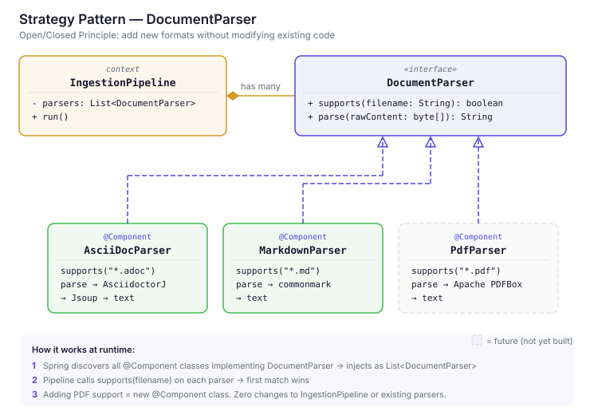

# Strategy Pattern — DocumentParser

How Atlas uses the Strategy pattern to handle multiple document formats
without modifying existing code (Open/Closed Principle).

## Class Diagram

## How it works

1. **Spring auto-discovers** all `@Component` classes implementing `DocumentParser`
   and injects them as `List<DocumentParser>` into `IngestionPipeline`.

2. **At runtime**, the pipeline calls `supports(filename)` on each parser.
   The first one that returns `true` handles the file.

3. **Adding a new format** = writing one new `@Component` class.
   Zero changes to `IngestionPipeline` or any existing parser.

## Why not inheritance?

| Approach | Adding PDF support requires |
|---|---|
| **Inheritance + Factory** | New subclass + edit factory's `if/else` chain |
| **Strategy (current)** | New `@Component` class only — nothing else changes |

Inheritance solves shared behavior. Our parsers don't share implementation —
AsciiDocParser uses AsciidoctorJ, MarkdownParser would use commonmark,
PdfParser would use Apache PDFBox. No common code to inherit.

## SOLID check

| Principle | How it's satisfied |
|---|---|
| **S** — Single Responsibility | Each parser handles exactly one format |
| **O** — Open/Closed | New formats added without modifying existing code |
| **L** — Liskov Substitution | `parse(byte[])` works for text and binary formats |
| **I** — Interface Segregation | Two methods — nothing unused |
| **D** — Dependency Inversion | Pipeline depends on `DocumentParser` interface, not concrete classes |

## Related ADRs

- **ADR-016** — `byte[]` input instead of `String` (Liskov Substitution)
- **ADR-017** — `supports()` for strategy selection
